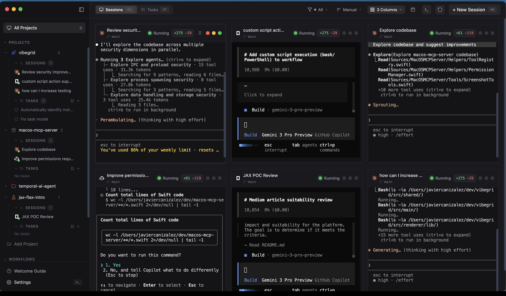
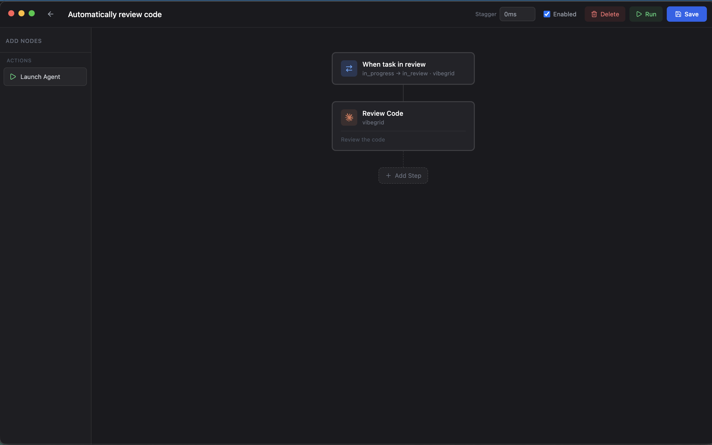

<p align="center">
  
</p>

<h1 align="center">VibeGrid</h1>

<p align="center">
  <strong>Terminal Manager for AI Coding Agents</strong>
</p>

<p align="center">
  Run multiple AI agents side by side — no wrappers, no API keys, no middleman.<br/>
  Just your CLI tools, organized.
</p>

<p align="center">
  <a href="https://github.com/jcanizalez/vibegrid/releases"></a>
  <a href="https://github.com/jcanizalez/vibegrid/blob/main/LICENSE"></a>
  <a href="https://github.com/jcanizalez/vibegrid/stargazers"></a>
  
</p>

<p align="center">
  <a href="#install">Install</a> &middot;
  <a href="#features">Features</a> &middot;
  <a href="#supported-agents">Agents</a> &middot;
  <a href="#development">Development</a>
</p>

---

<!-- SCREENSHOT_HERO: Replace with a full-window screenshot of VibeGrid in action -->
<p align="center">
  
</p>

## Why VibeGrid?

VibeGrid is a terminal manager built for developers who vibecode from the terminal. It spawns real CLI processes — `claude`, `codex`, `gh copilot` — and lets you see them all at once in a grid layout.

**Terminal-native, not a wrapper.** Every agent runs in its own PTY with full native output. When Claude Code ships a new feature, you get it immediately. No reimplementation needed, no API keys required.

**Multi-agent by design.** See 4, 6, or 10 agents working simultaneously across different projects. No other tool does this — most show one agent at a time.

**Orchestration built in.** Schedule workflows on a cron, queue tasks for agents to consume automatically, and review changes across all sessions from one place.

## Install

**macOS / Linux:**

```bash
curl -fsSL https://raw.githubusercontent.com/jcanizalez/vibegrid/main/install.sh | sh
```

**Windows (PowerShell):**

```powershell
irm https://raw.githubusercontent.com/jcanizalez/vibegrid/main/install.ps1 | iex
```

**Homebrew (macOS):**

```bash
brew tap jcanizalez/tap && brew install --cask vibegrid
```

Or download directly from [GitHub Releases](https://github.com/jcanizalez/vibegrid/releases).

## Features

### Multi-Agent Grid

Run Claude, Copilot, Codex, OpenCode, and Gemini in a responsive grid layout. Resize, reorder, minimize, and filter by status. Focus any terminal fullscreen with one click.

<!-- SCREENSHOT: Grid view with multiple agents running -->
<p align="center">
  
</p>

### Task Queue & Kanban Board

Manage tasks per project with a list view or a drag-and-drop kanban board (Todo, In Progress, Done). Tasks use markdown with a built-in template for descriptions and acceptance criteria. Start a task and it launches an agent with the description as the prompt — auto-completes when the agent finishes.

<!-- SCREENSHOT: Kanban board with tasks -->
<p align="center">
  
</p>

### Workflow Automation

Create multi-step workflows that launch agents with prompts, consume tasks from the queue, or target specific tasks. Schedule them manually, once, or on a recurring cron. Workflows are organized into Manual and Scheduled groups in the sidebar.

<!-- SCREENSHOT: Workflow editor with scheduled actions -->
<p align="center">
  
</p>

### Inline Diff Review

View git changes in a side panel. Click on any changed line to add a review comment. When you're done, send all comments to the agent as structured feedback with one click — the agent receives them as a follow-up prompt.

<!-- SCREENSHOT: Diff sidebar with inline comments -->
<p align="center">
  
</p>

### Project Management

Organize sessions by project with custom icons and colors. Quick-launch agents or worktree sessions from the sidebar. Each project shows running sessions and task status at a glance.

<!-- SCREENSHOT: Sidebar with projects and active sessions -->
<p align="center">
  
</p>

### Git Integration

View diffs, track file changes, stage, commit, and push directly from the terminal session. Full worktree support for safe parallel work on different branches.

### Claude Code Hooks

Deep integration with Claude Code via hooks. See real-time agent status (running, waiting, idle, error), handle permission requests, and respond to agent questions — all from VibeGrid or the floating widget.

### More

- **Command Palette** — fuzzy search for actions, terminals, recent sessions, and workflows
- **Floating Widget** — minimal always-on-top overlay showing agent status
- **Remote Hosts** — launch terminals on remote machines via SSH
- **Terminal Panel** — lightweight shell tabs for quick operations
- **Session Persistence** — restore previous sessions on restart
- **Auto-Update** — built-in update checking and installation
- **Cross-Platform** — macOS, Windows, and Linux

## Supported Agents

| Agent | Command |
|-------|---------|
| Claude Code | `claude` |
| GitHub Copilot | `gh copilot` |
| OpenAI Codex | `codex` |
| OpenCode | `opencode` |
| Google Gemini | `gemini` |

Any CLI tool that runs in a terminal works with VibeGrid. These are the agents with built-in status detection and icons.

## Development

**Prerequisites:** Node.js 20+, Yarn

```bash
# Install dependencies
yarn install

# Start in development mode
yarn dev

# Build for production
yarn build

# Package for your platform
yarn dist
```

## Contributing

Contributions are welcome. Please open an issue first to discuss what you'd like to change.

1. Fork the repo
2. Create your branch (`git checkout -b feature/my-feature`)
3. Commit your changes
4. Push and open a Pull Request

## License

[MIT](LICENSE) - Javier Canizalez
